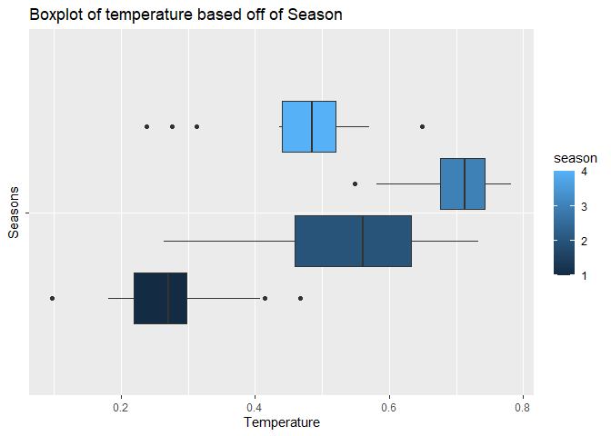

Project 2
================
George Bridges and Marcus Lee
6/27/2021

# Monday Report

## Introduction section ?

This section should briefly describes the data and the variable I will
have to work with

Target variable will be the `casual` and/or `registered` variables in
some way (perhaps the sum of them, that is up to us)

You should also mention the purpose of the analysis and the methods we
will use to model the response.

## Data

``` r
data_days <- read_csv("day.csv")
```

After looking at the `day.csv`, the variables not selected for this
analysis are listed below:

-   `instant`
-   `dteday`
-   `casual` I will be using the `cnt` variable
-   `registered` I will be using the `cnt` variable

``` r
data_days2 <- data_days %>% select(-c(instant, dteday, casual, registered))
```

``` r
data_days3 <- data_days2 %>% mutate(weekday = case_when(weekday==1 ~ "Monday",
                                                        weekday==2 ~ "Tuesday",
                                                        weekday==3 ~ "Wednesday",
                                                        weekday==4 ~ "Thursday",
                                                        weekday==5 ~ "Friday",
                                                        weekday==6 ~ "Saturday",
                                                        weekday==0 ~ "Sunday"))
```

The code below will filter by the day.

Note: The data below might need to be changed depending on how we are
going to model it.

``` r
# The code that is in comment is for the automation later 
# data_by_day <- data_days3 %>% filter(weekday == params$day) 
data_by_day <- data_days3 %>% filter(weekday=="Monday")
```

## Training and Testing set

I will be randomly sample from the data in order to form a training(use
70% of the data) and test set(use 30% of the data). I set a seed to make
the work reproducible.

``` r
set.seed(123)
train <- sample(1:nrow(data_by_day), size=nrow(data_by_day)*0.7)
test <- dplyr::setdiff(1:nrow(data_by_day), train)

daydataTrain <- data_by_day[train, ]
daydataTest <- data_by_day[test, ]
```

## Summary Statistics

I need to describe the purpose of this summary statistics/plot and what
the reader may be able to determine from it.

``` r
grouped_mean.sd_on_some_variables <- daydataTrain %>% group_by(season) %>% summarise(
  n=n(),
  avg_temp = round(mean(temp),2),
  avg_atemp = round(mean(atemp),2),
  avg_hum = round(mean(hum),2),
  avg_windspeed = round(mean(windspeed),2),
  avg_cnt = round(mean(cnt),2),
  sd_temp = round(sd(temp),2),
  sd_atemp = round(sd(atemp),2),
  sd_hum = round(sd(hum),2),
  sd_windspeed = round(sd(windspeed),2),
  sd_cnt = round(sd(cnt),2)
) %>% rename('Average temperature'=avg_temp,
             'Average feeling temperature'=avg_atemp,
             'Average humidity' = avg_hum,
             'Average Windspeed' = avg_windspeed,
             'Average count of total rental bikes'= avg_cnt,
             'Standard deviation of temperature' = sd_temp,
             'Standard deviation of feeling temperature' = sd_atemp,
             'Standard deviation of humidity' = sd_hum,
             'Standard deviation of windspeed' = sd_windspeed,
             'Standard deviation of count of total rental bikes' = sd_cnt)
```

``` r
kable(grouped_mean.sd_on_some_variables, caption= "Summary Statistics on some of the variables based off of the different seasons")
```

| season |   n | Average temperature | Average feeling temperature | Average humidity | Average Windspeed | Average count of total rental bikes | Standard deviation of temperature | Standard deviation of feeling temperature | Standard deviation of humidity | Standard deviation of windspeed | Standard deviation of count of total rental bikes |
|-------:|----:|--------------------:|----------------------------:|-----------------:|------------------:|------------------------------------:|----------------------------------:|------------------------------------------:|-------------------------------:|--------------------------------:|--------------------------------------------------:|
|      1 |  14 |                0.27 |                        0.28 |             0.56 |              0.22 |                             2312.64 |                              0.10 |                                      0.09 |                           0.15 |                            0.10 |                                           1201.64 |
|      2 |  20 |                0.55 |                        0.52 |             0.62 |              0.24 |                             4354.45 |                              0.13 |                                      0.11 |                           0.15 |                            0.08 |                                           1390.04 |
|      3 |  22 |                0.70 |                        0.65 |             0.65 |              0.17 |                             5720.95 |                              0.06 |                                      0.05 |                           0.10 |                            0.06 |                                           1292.39 |
|      4 |  17 |                0.46 |                        0.46 |             0.72 |              0.14 |                             4810.47 |                              0.11 |                                      0.09 |                           0.13 |                            0.08 |                                           1839.12 |

Summary Statistics on some of the variables based off of the different
seasons

``` r
# Box plot seasons temperature
ggplot(daydataTrain, aes(group=season, temp, y="", fill=season))+geom_boxplot()+ggtitle("Boxplot of temperature based off of Season")+ylab("Seasons")+xlab("Temperature")
```

<!-- -->

``` r
# Scatterplot cnt vs temp based off of season

ggplot(daydataTrain, aes(x=cnt, y=temp, color=season))+geom_point()+labs(x="Count of total rental bikes", y="Temperature", title="Scatterplot of Temperature vs Count of total rental bikes based off of seasons")
```

<!-- -->

``` r
# +geom_smooth(aes(cnt,temp),method=lm), scale_color_gradient(low="blue", high="red")

# Scatterplot of Temperature vs Windspeed
ggplot(daydataTrain, aes(x=temp,y=windspeed, color=season))+geom_point()+geom_smooth(aes(temp,windspeed),method=lm)+labs(x="Temperature", y="Windspeed", title="Scatterplot of Temperature vs Windspeed")
```

    ## `geom_smooth()` using formula 'y ~ x'

<!-- -->

## Modeling

What Marcus will be doing tomorrow(6/28/2021):

explanation of ensemble model (going to mention that I did not include
some of the categorical variables)

``` r
# Did not include the categorical variables
model_1 <- lm(cnt ~ temp+atemp+hum+windspeed, data=daydataTrain)
summary(model_1)
```

    ## 
    ## Call:
    ## lm(formula = cnt ~ temp + atemp + hum + windspeed, data = daydataTrain)
    ## 
    ## Residuals:
    ##      Min       1Q   Median       3Q      Max 
    ## -3059.61  -774.06    18.58  1034.68  2144.22 
    ## 
    ## Coefficients:
    ##             Estimate Std. Error t value Pr(>|t|)    
    ## (Intercept)     3393       1114   3.045 0.003306 ** 
    ## temp          -22694      11490  -1.975 0.052312 .  
    ## atemp          33655      13155   2.558 0.012748 *  
    ## hum            -4555       1225  -3.719 0.000407 ***
    ## windspeed      -4851       1953  -2.484 0.015463 *  
    ## ---
    ## Signif. codes:  0 '***' 0.001 '**' 0.01 '*' 0.05 '.' 0.1 ' ' 1
    ## 
    ## Residual standard error: 1308 on 68 degrees of freedom
    ## Multiple R-squared:  0.5278, Adjusted R-squared:    0.5 
    ## F-statistic:    19 on 4 and 68 DF,  p-value: 1.575e-10

``` r
anova(model_1)
```

    ## Analysis of Variance Table
    ## 
    ## Response: cnt
    ##           Df    Sum Sq  Mean Sq F value    Pr(>F)    
    ## temp       1  93008306 93008306 54.3393 3.026e-10 ***
    ## atemp      1   9098506  9098506  5.3157  0.024191 *  
    ## hum        1  17434204 17434204 10.1858  0.002143 ** 
    ## windspeed  1  10560585 10560585  6.1699  0.015463 *  
    ## Residuals 68 116390308  1711622                      
    ## ---
    ## Signif. codes:  0 '***' 0.001 '**' 0.01 '*' 0.05 '.' 0.1 ' ' 1

``` r
VIF(model_1)
```

    ##       temp      atemp        hum  windspeed 
    ## 179.063477 181.408448   1.245382   1.198662

``` r
trctrl <- trainControl(method = "repeatedcv", number=10, repeats=5)
#create a boosted model tree
boostree <- train(cnt ~ temp+atemp+hum+windspeed, 
               method = 'gbm', 
               trControl=trctrl, 
               data=daydataTrain, 
               preProcess=c("center", "scale"),
               verbose = FALSE)
#predict the values for our cnt variable and compare it to our testing data. 
boostree_pred <- predict(boostree, newdata=daydataTest)
#a frequency of how many of each response there is. 
boostree_pred2 <- table(boostree_pred, daydataTest$cnt)
misclass <- 1-(sum(diag(boostree_pred2))/sum(boostree_pred2))
misclass
```

    ## [1] 0.96875

## Comparison
