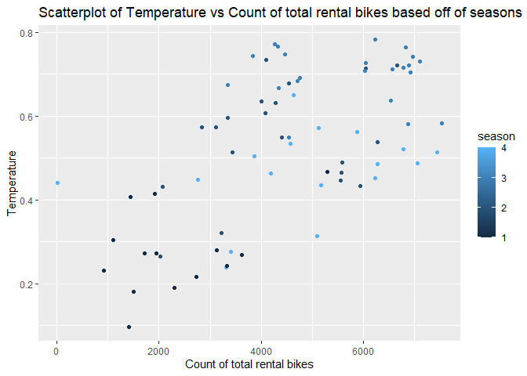

Project 2
================
George Bridges and Marcus Lee
6/27/2021

# Monday Report

## Introduction section ?

This section should briefly describes the data and the variable I will
have to work with

Target variable will be the `casual` and/or `registered` variables in
some way (perhaps the sum of them, that is up to us)

You should also mention the purpose of the analysis and the methods we
will use to model the response.

## Data

``` r
data_days <- read_csv("day.csv")
```

After looking at the `day.csv`, the variables not selected for this
analysis are listed below:

-   `instant`
-   `dteday`
-   `casual` I will be using the `cnt` variable
-   `registered` I will be using the `cnt` variable

``` r
data_days2 <- data_days %>% select(-c(instant, dteday, casual, registered))
```

``` r
data_days3 <- data_days2 %>% mutate(weekday = case_when(weekday==1 ~ "Monday",
                                                        weekday==2 ~ "Tuesday",
                                                        weekday==3 ~ "Wednesday",
                                                        weekday==4 ~ "Thursday",
                                                        weekday==5 ~ "Friday",
                                                        weekday==6 ~ "Saturday",
                                                        weekday==0 ~ "Sunday"))
```

The code below will filter by the day.

Note: The data below might need to be changed depending on how we are
going to model it.

``` r
# The code that is in comment is for the automation later 
# data_by_day <- data_days3 %>% filter(weekday == params$day) 
data_by_day <- data_days3 %>% filter(weekday=="Monday")
```

## Training and Testing set

I will be randomly sample from the data in order to form a training(use
70% of the data) and test set(use 30% of the data). I set a seed to make
the work reproducible.

``` r
set.seed(123)
trainIndex <- createDataPartition(data_by_day$cnt, p=0.7, list = FALSE)

train.data_by_day <- data_by_day[trainIndex,]
test.data_by_day <- data_by_day[-trainIndex,]
```

## Summary Statistics

I need to describe the purpse of this summary statistics/plot and what
the reader may be able to deteremine from it.

``` r
grouped_mean.sd_on_some_variables <- train.data_by_day %>% group_by(season) %>% summarise(
  n=n(),
  avg_temp = round(mean(temp),2),
  avg_atemp = round(mean(atemp),2),
  avg_hum = round(mean(hum),2),
  avg_windspeed = round(mean(windspeed),2),
  avg_cnt = round(mean(cnt),2),
  sd_temp = round(sd(temp),2),
  sd_atemp = round(sd(atemp),2),
  sd_hum = round(sd(hum),2),
  sd_windspeed = round(sd(windspeed),2),
  sd_cnt = round(sd(cnt),2)
) %>% rename('Average temperature'=avg_temp,
             'Average feeling temperature'=avg_atemp,
             'Average humidity' = avg_hum,
             'Average Windspeed' = avg_windspeed,
             'Average count of total rental bikes'= avg_cnt,
             'Standard deviation of temperature' = sd_temp,
             'Standard deviation of feeling temperature' = sd_atemp,
             'Standard deviation of humidity' = sd_hum,
             'Standard deviation of windspeed' = sd_windspeed,
             'Standard deviation of count of total rental bikes' = sd_cnt)
```

``` r
kable(grouped_mean.sd_on_some_variables, caption= "Summary Statistics on some of the variables based off of the different seasons")
```

| season |   n | Average temperature | Average feeling temperature | Average humidity | Average Windspeed | Average count of total rental bikes | Standard deviation of temperature | Standard deviation of feeling temperature | Standard deviation of humidity | Standard deviation of windspeed | Standard deviation of count of total rental bikes |
|-------:|----:|--------------------:|----------------------------:|-----------------:|------------------:|------------------------------------:|----------------------------------:|------------------------------------------:|-------------------------------:|--------------------------------:|--------------------------------------------------:|
|      1 |  18 |                0.30 |                        0.30 |             0.55 |              0.23 |                             2675.50 |                              0.10 |                                      0.10 |                           0.13 |                            0.08 |                                           1470.39 |
|      2 |  17 |                0.54 |                        0.52 |             0.60 |              0.24 |                             4706.00 |                              0.12 |                                      0.11 |                           0.16 |                            0.07 |                                           1419.53 |
|      3 |  19 |                0.69 |                        0.64 |             0.64 |              0.17 |                             5520.11 |                              0.07 |                                      0.06 |                           0.10 |                            0.06 |                                           1357.74 |
|      4 |  22 |                0.43 |                        0.43 |             0.73 |              0.15 |                             4586.77 |                              0.09 |                                      0.08 |                           0.12 |                            0.08 |                                           1595.68 |

Summary Statistics on some of the variables based off of the different
seasons

Need to produce 3 graphs

``` r
# Box plot seasons temperature
ggplot(train.data_by_day, aes(group=season, temp, y="", fill=season))+geom_boxplot()+ggtitle("Boxplot of temperature based off of Season")+ylab("Seasons")+xlab("Temperature")
```

<!-- -->

``` r
# Scatterplot cnt vs temp based off of season

ggplot(train.data_by_day, aes(x=cnt, y=temp, color=season))+geom_point()+labs(x="Temperature", y="Count of total rental bikes", title="Scatterplot of Temperature vs Count of total rental bikes based off of seasons")
```

<!-- -->

``` r
#
```

## Summarization

## Modeling

## Comparison
