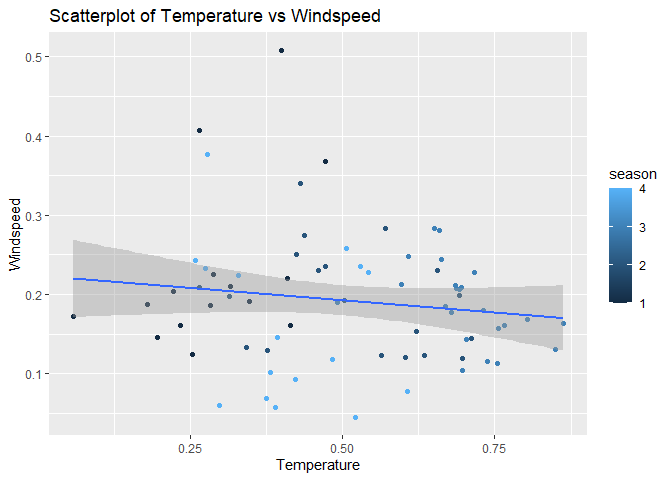

Project 2
================
George Bridges and Marcus Lee
6/27/2021

# Saturday Report

## Introduction section

This data set contains the daily count of rental bikes between the years
of 2011 and 2012 in the Capital bike share system with the corresponding
weather and seasonal information.

The purpose of our analysis is to try to predict the number of users
using predictive models which will include linear regressions, and
different tree models. See the modeling section to know more about which
models we have used.

## Data

``` r
data_days <- read_csv("day.csv")
```

After looking at the `day.csv`, the variables not selected for Marcus
analysis are listed below:

-   `instant`
-   `dteday`
-   `casual` I will be using the `cnt` variable
-   `registered` I will be using the `cnt` variable
-   `yr`
-   `mnth`
-   `holiday`
-   `workingday`
-   `weathersit`

George decided to include weathersit, but exclude season. I also
included ‘holiday’ and ‘workingday’ I will be using the ‘cnt’ variable
in place of ‘casual’ or ‘registered.’

``` r
data_days2 <- data_days %>% select(-c(instant, dteday, casual, registered, yr, mnth, holiday, workingday, weathersit))
```

``` r
data_days22 <- data_days %>% select(-c(instant, dteday, casual, registered, yr, mnth, season))
```

``` r
data_days3 <- data_days2 %>% mutate(weekday = case_when(weekday==1 ~ "Monday",
                                                        weekday==2 ~ "Tuesday",
                                                        weekday==3 ~ "Wednesday",
                                                        weekday==4 ~ "Thursday",
                                                        weekday==5 ~ "Friday",
                                                        weekday==6 ~ "Saturday",
                                                        weekday==0 ~ "Sunday"))
```

``` r
data_days33 <- data_days22 %>% mutate(weekday = case_when(weekday==1 ~ "Monday",
                                                        weekday==2 ~ "Tuesday",
                                                        weekday==3 ~ "Wednesday",
                                                        weekday==4 ~ "Thursday",
                                                        weekday==5 ~ "Friday",
                                                        weekday==6 ~ "Saturday",
                                                        weekday==0 ~ "Sunday"))
```

The code below will filter by the day.

``` r
# The code that is in comment is for the automation later 
data_by_day <- data_days3 %>% filter(weekday == params$day) 
#data_by_day <- data_days3 %>% filter(weekday=="Monday")
```

``` r
#data_by_day22 <- data_days33 %>% filter(weekday=="Monday")
data_by_day22 <- data_days33 %>% filter(weekday == params$day)
```

## Training and Testing set

I will be randomly sample from the data in order to form a training(use
70% of the data) and test set(use 30% of the data). I set a seed to make
the work reproducible.

``` r
set.seed(123)
train <- sample(1:nrow(data_by_day), size=nrow(data_by_day)*0.7)
test <- dplyr::setdiff(1:nrow(data_by_day), train)

daydataTrain <- data_by_day[train, ]
daydataTest <- data_by_day[test, ]
```

``` r
train2 <- sample(1:nrow(data_by_day22), size=nrow(data_by_day22)*0.7)
test2 <- dplyr::setdiff(1:nrow(data_by_day22), train2)

daydataTrain2 <- data_by_day22[train2, ]
daydataTest2 <- data_by_day22[test2, ]
```

## Summary Statistics

I need to describe the purpose of this summary statistics/plot and what
the reader may be able to determine from it.

``` r
grouped_mean.sd_on_some_variables <- daydataTrain %>% group_by(season) %>% summarise(
  n=n(),
  avg_temp = round(mean(temp),2),
  avg_atemp = round(mean(atemp),2),
  avg_hum = round(mean(hum),2),
  avg_windspeed = round(mean(windspeed),2),
  avg_cnt = round(mean(cnt),2),
  sd_temp = round(sd(temp),2),
  sd_atemp = round(sd(atemp),2),
  sd_hum = round(sd(hum),2),
  sd_windspeed = round(sd(windspeed),2),
  sd_cnt = round(sd(cnt),2)
) %>% rename('Average temperature'=avg_temp,
             'Average feeling temperature'=avg_atemp,
             'Average humidity' = avg_hum,
             'Average Windspeed' = avg_windspeed,
             'Average count of total rental bikes'= avg_cnt,
             'Standard deviation of temperature' = sd_temp,
             'Standard deviation of feeling temperature' = sd_atemp,
             'Standard deviation of humidity' = sd_hum,
             'Standard deviation of windspeed' = sd_windspeed,
             'Standard deviation of count of total rental bikes' = sd_cnt)
```

``` r
grouped_meansd <- daydataTrain2 %>% group_by(weathersit) %>% summarise(
  n=n(),
  avg_temp = round(mean(temp),2),
  avg_atemp = round(mean(atemp),2),
  avg_hum = round(mean(hum),2),
  avg_windspeed = round(mean(windspeed),2),
  avg_cnt = round(mean(cnt),2),
  avg_hol = round(mean(holiday),2),
  avg_work = round(mean(workingday),2),
  sd_temp = round(sd(temp),2),
  sd_atemp = round(sd(atemp),2),
  sd_hum = round(sd(hum),2),
  sd_windspeed = round(sd(windspeed),2),
  sd_cnt = round(sd(cnt),2)
  
) %>% rename('Average temperature'=avg_temp,
             'Average feeling temperature'=avg_atemp,
             'Average humidity' = avg_hum,
             'Average Windspeed' = avg_windspeed,
             'Average count of total rental bikes'= avg_cnt,
             'Proportion of days that are holidays' = avg_hol,
             'Proportion of days that are working days' = avg_work,
             'Standard deviation of temperature' = sd_temp,
             'Standard deviation of feeling temperature' = sd_atemp,
             'Standard deviation of humidity' = sd_hum,
             'Standard deviation of windspeed' = sd_windspeed,
             'Standard deviation of count of total rental bikes' = sd_cnt)
```

``` r
kable(grouped_mean.sd_on_some_variables, caption= "Summary Statistics on some of the variables based off of the different seasons")
```

| season |   n | Average temperature | Average feeling temperature | Average humidity | Average Windspeed | Average count of total rental bikes | Standard deviation of temperature | Standard deviation of feeling temperature | Standard deviation of humidity | Standard deviation of windspeed | Standard deviation of count of total rental bikes |
|-------:|----:|--------------------:|----------------------------:|-----------------:|------------------:|------------------------------------:|----------------------------------:|------------------------------------------:|-------------------------------:|--------------------------------:|--------------------------------------------------:|
|      1 |  15 |                0.29 |                        0.29 |             0.53 |              0.23 |                             2391.33 |                              0.11 |                                      0.10 |                           0.18 |                            0.11 |                                           1236.38 |
|      2 |  19 |                0.51 |                        0.49 |             0.64 |              0.19 |                             4948.63 |                              0.14 |                                      0.12 |                           0.19 |                            0.07 |                                           1953.77 |
|      3 |  23 |                0.70 |                        0.65 |             0.63 |              0.19 |                             5746.70 |                              0.08 |                                      0.07 |                           0.12 |                            0.05 |                                           1433.17 |
|      4 |  16 |                0.41 |                        0.41 |             0.63 |              0.16 |                             5263.06 |                              0.11 |                                      0.10 |                           0.15 |                            0.10 |                                           1976.37 |

Summary Statistics on some of the variables based off of the different
seasons

``` r
kable(grouped_meansd, caption= "Summary Statistics on some of the variables based off of the different weather situations")
```

| weathersit |   n | Average temperature | Average feeling temperature | Average humidity | Average Windspeed | Average count of total rental bikes | Proportion of days that are holidays | Proportion of days that are working days | Standard deviation of temperature | Standard deviation of feeling temperature | Standard deviation of humidity | Standard deviation of windspeed | Standard deviation of count of total rental bikes |
|-----------:|----:|--------------------:|----------------------------:|-----------------:|------------------:|------------------------------------:|-------------------------------------:|-----------------------------------------:|----------------------------------:|------------------------------------------:|-------------------------------:|--------------------------------:|--------------------------------------------------:|
|          1 |  47 |                0.51 |                        0.49 |             0.54 |              0.18 |                             4791.32 |                                    0 |                                        0 |                              0.20 |                                      0.18 |                           0.12 |                            0.08 |                                           2004.07 |
|          2 |  24 |                0.46 |                        0.44 |             0.74 |              0.18 |                             4020.50 |                                    0 |                                        0 |                              0.18 |                                      0.15 |                           0.13 |                            0.08 |                                           2066.68 |
|          3 |   2 |                0.34 |                        0.33 |             0.89 |              0.35 |                              711.00 |                                    0 |                                        0 |                              0.12 |                                      0.14 |                           0.00 |                            0.01 |                                            118.79 |

Summary Statistics on some of the variables based off of the different
weather situations

Below we see a contingency table that displays holidays and working
days. As one would expect, no day is both a working day and a holiday

``` r
table(daydataTrain2$holiday, daydataTrain2$workingday)
```

    ##    
    ##      0
    ##   0 73

From the summary statistics produced above, we can inspect the averages
and standard deviations for the `temp`, `atemp` `hum`, `windspeed`,
`cnt` variables grouped by the `season` variable. Based on the sample
size for each `season`, we can expect some of the variables to be
skewed. Each of these statistics are also available in the second table
except grouped by weather situation. Similarly, we can expect some
skewness based on the different numbers of days that were each weather
situation. Also note there are the averages for workingdays and holiday,
showing just how often a working day and holiday

Here below are multiple plots based off of some of the variables in the
`daydataTrain`. For each of these plots, I was trying to get a feeling
like if the weather is much colder, then there would be a lesser amount
of total rental bikes including both the `casual` and `registered`
variable.

``` r
# Box plot seasons temperature
ggplot(daydataTrain, aes(group=season, temp, y="", fill=season))+geom_boxplot()+ggtitle("Boxplot of temperature based off of Season")+ylab("Seasons")+xlab("Temperature")
```

<!-- -->

``` r
# Scatterplot cnt vs temp based off of season

ggplot(daydataTrain, aes(x=cnt, y=temp, color=season))+geom_point()+labs(x="Count of total rental bikes", y="Temperature", title="Scatterplot of Temperature vs Count of total rental bikes based off of seasons")
```

<!-- -->

``` r
# Scatterplot of Temperature vs Windspeed
ggplot(daydataTrain, aes(x=temp,y=windspeed, color=season))+geom_point()+geom_smooth(aes(temp,windspeed),method=lm)+labs(x="Temperature", y="Windspeed", title="Scatterplot of Temperature vs Windspeed")
```

    ## `geom_smooth()` using formula 'y ~ x'

<!-- -->

``` r
#boxplot temperature versus weather situation
ggplot(daydataTrain2, aes(group=weathersit, temp, y="", fill=weathersit))+geom_boxplot()+ggtitle("Boxplot of temperature based off of Weather Situation") +ylab("Weather Situations")+xlab("Temperature")
```

<!-- -->

``` r
#scatterplot cnt vs humidity based off of weather situation
ggplot(daydataTrain2, aes(x=cnt, y=hum, color=weathersit))+geom_point()+labs(x="Count of total rental bikes", y="Humidity", title="Scatterplot of Humidity vs Count of total rental bikes based off of weather situations")
```

<!-- -->

``` r
# Scatterplot of Humidity vs Windspeed
ggplot(daydataTrain2, aes(x=hum,y=windspeed, color=weathersit))+geom_point()+geom_smooth(aes(hum,windspeed),method=lm)+labs(x="Humidity", y="Windspeed", title="Scatterplot of Humidity vs Windspeed")
```

    ## `geom_smooth()` using formula 'y ~ x'

<!-- -->

Looking at the first boxplot, we can inspect whether the temperatures
are skewed based off of season and see potential outliers. For the
second boxplot, we can see weather humidity is skewed based off weather
situation and see potential outliers.

For the 1st scatterplot, we can inspect the relationship between the
count of total rental bikes against temperature based off of different
seasons. If we were to make separate regression fit lines, we would
expect each of the fit lines to have different slopes because we grouped
by season. So if the total rental bikes increases, we can assume that
the temperature increases as well.

For the 2nd scatterplot, we can inspect the relationship between the
temperature and the windspeed based off of the different seasons. Based
off of the plot, as the temperature increases, windspeed may decrease.

For the 3rd scatterplot, we can see the relationship between total
rental bikes against humidity based on weather situation. I would expect
higher humidity to mean less rented bikes.

For the 4th scatterplot, we can see the relationship between windspeed
and humidity in the different weather situations. I would not expect to
see a strong relationship here for any of the weather situations, though
it is possible that dryer air is lighter and therefore might blow a
little faster but that is pure speculation on George’s part.

## Modeling

A linear regression model attempts to model the relationship between
variables by fitting a linear equation to observed data. The most common
method of fitting is that of least squares, in which the line is ‘drawn’
based on the line that will minimize the sum of the squares of the
vertical deviations of each data point from the line, also called the
residuals of each data point. If a single explanatory variable is used,
the model is called simple linear regression, if multiple explanatory
variables are used then it is called multiple linear regression.

``` r
# Did not include the categorical variables
model_1 <- lm(cnt ~ temp+atemp+hum+windspeed, data=daydataTrain)
summary(model_1)
```

    ## 
    ## Call:
    ## lm(formula = cnt ~ temp + atemp + hum + windspeed, data = daydataTrain)
    ## 
    ## Residuals:
    ##     Min      1Q  Median      3Q     Max 
    ## -4652.2 -1062.5   -14.9   884.1  3177.1 
    ## 
    ## Coefficients:
    ##             Estimate Std. Error t value Pr(>|t|)
    ## (Intercept)     2080       1282   1.622    0.109
    ## temp          -16047      13698  -1.171    0.245
    ## atemp          25834      15568   1.659    0.102
    ## hum            -1690       1280  -1.321    0.191
    ## windspeed      -3420       2498  -1.369    0.176
    ## 
    ## Residual standard error: 1600 on 68 degrees of freedom
    ## Multiple R-squared:  0.4296, Adjusted R-squared:  0.396 
    ## F-statistic:  12.8 on 4 and 68 DF,  p-value: 8.028e-08

``` r
anova(model_1)
```

    ## Analysis of Variance Table
    ## 
    ## Response: cnt
    ##           Df    Sum Sq   Mean Sq F value   Pr(>F)    
    ## temp       1 116161444 116161444 45.3784 4.22e-09 ***
    ## atemp      1   7663293   7663293  2.9937  0.08813 .  
    ## hum        1   2453602   2453602  0.9585  0.33104    
    ## windspeed  1   4797219   4797219  1.8740  0.17552    
    ## Residuals 68 174069189   2559841                     
    ## ---
    ## Signif. codes:  0 '***' 0.001 '**' 0.01 '*' 0.05 '.' 0.1 ' ' 1

``` r
VIF(model_1)
```

    ##       temp      atemp        hum  windspeed 
    ## 187.256238 188.633119   1.163160   1.166271

``` r
#included weathersit and temp, the two variables I thought would be most predictive
model_2 <- lm(cnt ~ weathersit+temp, data=daydataTrain2)
summary(model_2)
```

    ## 
    ## Call:
    ## lm(formula = cnt ~ weathersit + temp, data = daydataTrain2)
    ## 
    ## Residuals:
    ##    Min     1Q Median     3Q    Max 
    ##  -3972  -1153   -176   1076   3746 
    ## 
    ## Coefficients:
    ##             Estimate Std. Error t value Pr(>|t|)    
    ## (Intercept)   2528.4      820.7   3.081  0.00295 ** 
    ## weathersit    -765.3      372.8  -2.053  0.04384 *  
    ## temp          6013.2     1056.0   5.694 2.69e-07 ***
    ## ---
    ## Signif. codes:  0 '***' 0.001 '**' 0.01 '*' 0.05 '.' 0.1 ' ' 1
    ## 
    ## Residual standard error: 1690 on 70 degrees of freedom
    ## Multiple R-squared:  0.3772, Adjusted R-squared:  0.3594 
    ## F-statistic:  21.2 on 2 and 70 DF,  p-value: 6.343e-08

``` r
anova(model_2)
```

    ## Analysis of Variance Table
    ## 
    ## Response: cnt
    ##            Df    Sum Sq  Mean Sq F value    Pr(>F)    
    ## weathersit  1  28452944 28452944   9.968   0.00235 ** 
    ## temp        1  92560329 92560329  32.427 2.687e-07 ***
    ## Residuals  70 199809566  2854422                      
    ## ---
    ## Signif. codes:  0 '***' 0.001 '**' 0.01 '*' 0.05 '.' 0.1 ' ' 1

``` r
VIF(model_2)
```

    ## weathersit       temp 
    ##   1.035217   1.035217

The idea of fitting a random forest model is that you take bootstrap
samples, and fit a tree to each of those using a random subset of the
predictors. Finally, you average the results. I used the ‘rf’ method,
the training data set, and repeated cross validation to fit the model, I
then test it on the test data.

``` r
trctrl <- trainControl(method = "repeatedcv", number = 10, repeats = 10)
#create random forest model
raFore <- train(cnt ~ temp+atemp+hum+windspeed+weathersit,
                method = "rf",
                trControl = trctrl,
                data = daydataTrain2,
                preProcess = c("center", "scale"))
#predict for our cnt variable and compare to test data
raFore_pred <- predict(raFore, newdata = daydataTest2)

raFore_pred2 <- table(raFore_pred, daydataTest2$cnt)
misclass2 <- 1 - (sum(diag(raFore_pred2))/sum(raFore_pred2))
misclass2
```

    ## [1] 0.84375

To predict the total amount of rental bikes, I used the ensemble model
using the `gbm` method and I tuned on the training set(Using repeated
cross validation). Also, I evaluated on the test data set for figuring
out the misclassification rate and I would use this to make a better
model.

``` r
trctrl <- trainControl(method = "repeatedcv", number=10, repeats=5)
#create a boosted model tree
boostree <- train(cnt ~ temp+atemp+hum+windspeed, 
               method = 'gbm', 
               trControl=trctrl, 
               data=daydataTrain, 
               preProcess=c("center", "scale"),
               verbose = FALSE)
#predict the values for our cnt variable and compare it to our testing data. 
boostree_pred <- predict(boostree, newdata=daydataTest)
#a frequency of how many of each response there is. 
boostree_pred2 <- table(boostree_pred, daydataTest$cnt)
misclass <- 1-(sum(diag(boostree_pred2))/sum(boostree_pred2))
misclass
```

    ## [1] 0.875

## Comparison
